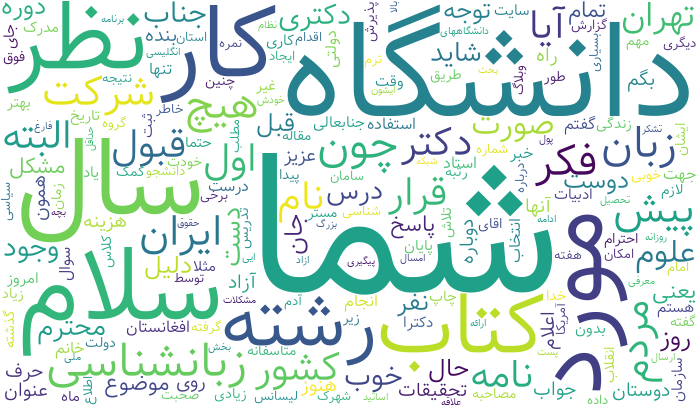
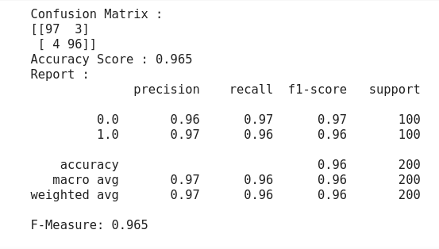

# Persian-Spam-Classifier
A python code to classify whether a message is spam or ham.

## Description
This project's goal is to classify spam and ham messages in persian emails. I used TF_IDF to vectorize texts and then made Naive Bayes Model to classify them.

My dataset conteins 1000 persian emails of which 500 are spam and 500 are ham. First I splited train and test using Staritified sapmling based on being spam or ham so 
that my train set contains 800 emails with 400 spams and 400 hams and my test set contains 200 emails with 100 spams and 100 hams. After encoding data labels I 
made spam and ham word clouds using [wordcloud-fa](https://github.com/alihoseiny/word_cloud_fa). you can see the pictures below.

### Spam Wordcloud

### Ham Wordcloud

After imaging wordclouds I got a better view of the data so I started vectorizing texts and fitting it to my Naive Bayes Model. 

## Result and accuracy

You can see the test set confusion matrix below.

More information about model and its report are shown in the photo belown.

